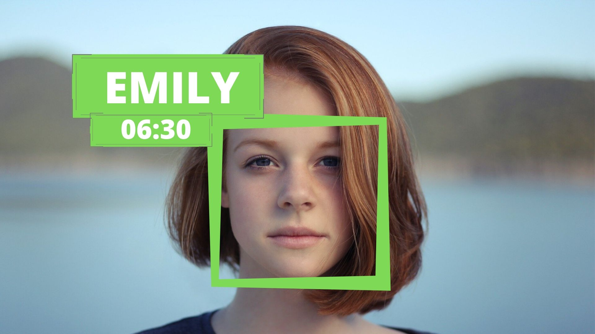

# Image Processing based Attendance System

In this video we are going to learn how to perform Facial recognition with high accuracy. We will first briefly go through the theory and learn the basic implementation. Then we will create an Attendance project that will use webcam to detect faces and record the attendance live in an excel sheet.

please visit: https://www.youtube.com/watch?v=sz25xxF_AVE

for detailed description: https://medium.com/@ageitgey/machine-learning-is-fun-part-4-modern-face-recognition-with-deep-learning-c3cffc121d78

